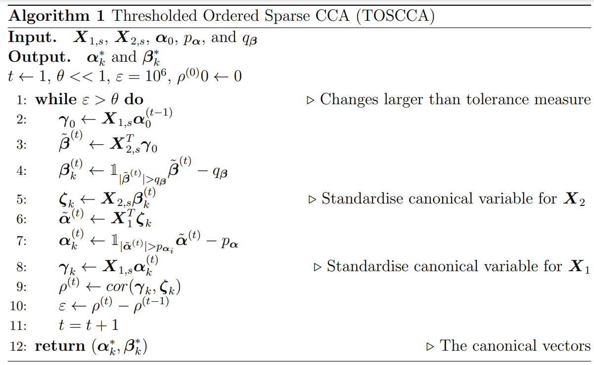

<!-- Improved compatibility of back to top link: See: https://github.com/othneildrew/Best-README-Template/pull/73 -->

<!--
*** Thanks for checking out the Best-README-Template. If you have a suggestion
*** that would make this better, please fork the repo and create a pull request
*** or simply open an issue with the tag "enhancement".
*** Don't forget to give the project a star!
*** Thanks again! Now go create something AMAZING! :D
-->

<!-- PROJECT SHIELDS -->
<!--
*** I'm using markdown "reference style" links for readability.
*** Reference links are enclosed in brackets [ ] instead of parentheses ( ).
*** See the bottom of this document for the declaration of the reference variables
*** for contributors-url, forks-url, etc. This is an optional, concise syntax you may use.
*** https://www.markdownguide.org/basic-syntax/#reference-style-links
-->

<!-- TABLE OF CONTENTS -->

  
Table of Contents

  <ol>
    <li>
      <a href="#about-the-project">About The Project</a>
      <ul>
        <li><a href="#built-with">Built With</a></li>
      </ul>
    </li>
    <li>
      <a href="#getting-started">Getting Started</a>
    </li>
    <li><a href="#usage">Usage</a></li>
    <li><a href="#contact">Contact</a></li>
  </ol>

<!-- ABOUT THE PACKAGE -->
## About The Project

This R-package contains the software to compute thresholded ordered sparse canonical correlation analysis (toscca); this approach to canonical correlation analysis (cca) is described in the paper (x). 

The main functions of the package are:
* toscca: used to compute the canonical correlations for one or more compoenents at some sparsity level.
* perm.toscca: runs the permutation and returns the permuted correlation values. 
* cpev.fun: calculates the cumulative percentage of explained variance.

The details of the method are fully described in the paper

The [algorithm]("/example/algorithm.png") for the functions is:

(<a href="#readme-top">back to top</a>)

<!-- USAGE EXAMPLES -->
## Usage

A comprehensive example to recreate the plots in the articles is available in the example folder

_For more examples, please refer to the [Example](https://github.com/nuria-sv/toscca/tree/master/example)_

(<a href="#readme-top">back to top</a>)

<!-- CONTACT -->
## Contact

Nuria Senar  - n.senarvilladeamigo@amsterdamumc.nl

Project Link: [https://github.com/nuria-sv/toscca](https://github.com/nuria-sv/toscca)

(<a href="#readme-top">back to top</a>)

