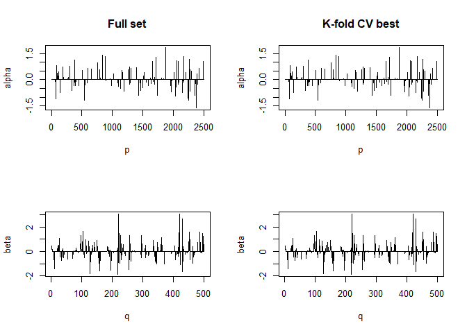
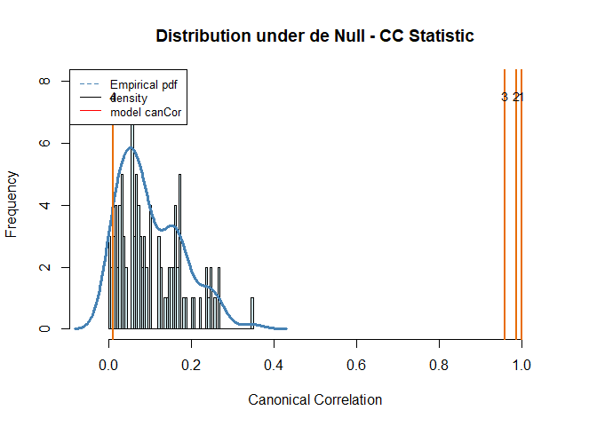
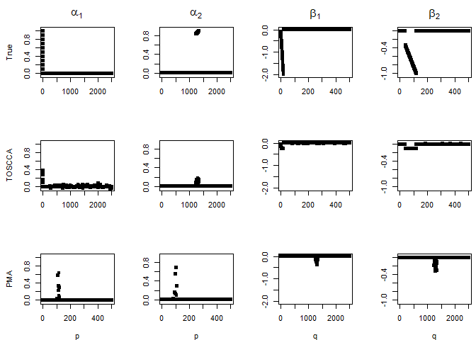
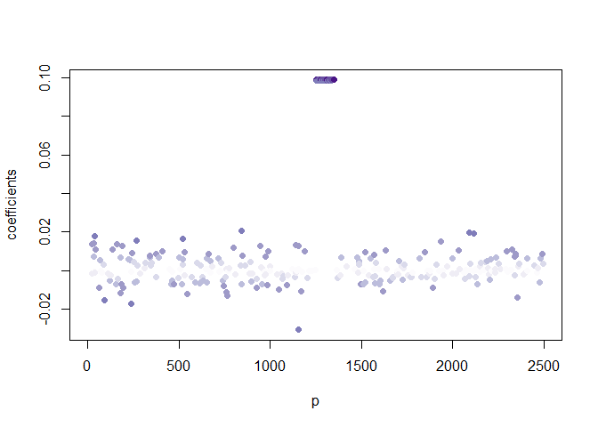
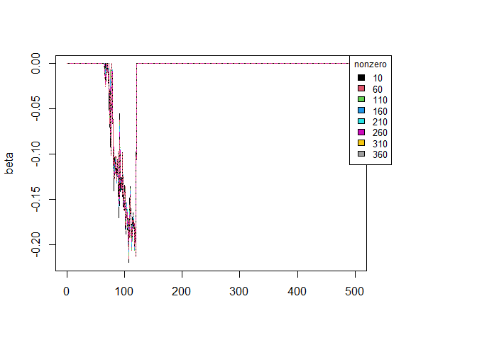
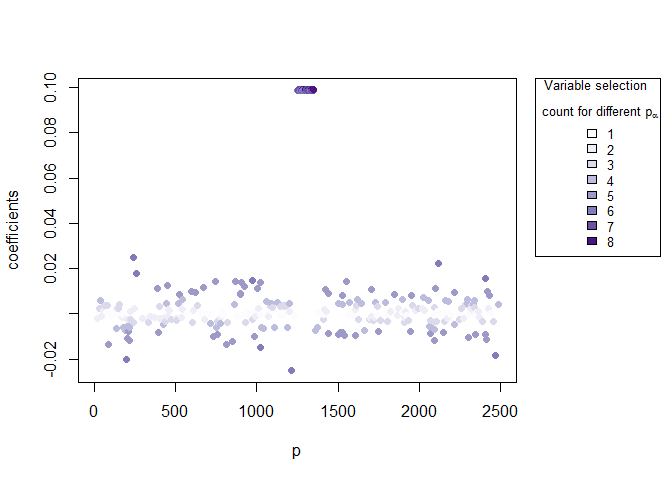

<!-- README.md is generated from README.Rmd. Please edit that file -->

# toscca

<!-- badges: start -->
<!-- badges: end -->

The goal of toscca is to …

## Installation

You can install the development version of toscca from
[GitHub](https://github.com/) with:

``` r
# install.packages("devtools")
devtools::install_github("nuria-sv/toscca")
```

## Example

This is a basic example which shows you how to reproduce the analysis
described in “A framework for interpretation and testing of sparse
canonical correlations”. The [algorithm]("/example/algorithm.png") for the functions is:


## Simulations

We simulate data for 3 underlying signals of different size on a
high-dimensional setting. That is, $$
\mathbf{X} \in \mathbb{R}^{n\times p} \quad \text{and} \quad \mathbf{Y}\in \mathbb{R}^{n\times q}, 
\\
\text{where } n = 100, \text{ } p = 2500 \text{ and } q = 500.
$$

## Canonical Correlation Analysis

We use the method described in the paper, Thresholded Ordered Sparse
Canonical Correlation Analysis (TOSCCA), to uncover the underlying
processes linking the data.

``` r
X = standardVar(X0)
Y = standardVar(Y0)
K = 4                                       # number of components to be estimated
nonz_x = rep(100, K)                        # number of nonzero variables for X
nonz_y = rep(100, K)                        # number of nonzero variables for Y
init   = "uniform"                          # type of initialisation
cca_toscca  = toscca::toscca(X, Y, nonz_x, nonz_y, K, init, combination = FALSE)
#> 
#> __________________________________________ 
#>  For component K =  1 : 
#> | . . . . . . . . . . . . . . . . . . . . . . . . . . . . . . . . . . . . . .  | 100 %          Common convergence error: 0 & Iterations: 4 
#> k-fold cv max. cancor 
#>             0.9999408 
#> 
#>  ........................................ 
#>  # nonzero A: 100
#>  # nonzero B: 100
#>  ........................................
```


    #> 
    #> __________________________________________ 
    #>  For component K =  2 : 
    #> | . . . . . . . . . . . . . . . . . . . . . . . . . . . . . . . . . . . . . .  | 100 %          Common convergence error: 0 & Iterations: 8 
    #> k-fold cv max. cancor 
    #>             0.9785591 
    #> 
    #>  ........................................ 
    #>  # nonzero A: 100
    #>  # nonzero B: 100
    #>  ........................................


    #> 
    #> __________________________________________ 
    #>  For component K =  3 : 
    #> | . . . . . . . . . . . . . . . . . . . . . . . . . . . . . . . . . . . . . .  | 100 %          Common convergence error: 0 & Iterations: 21 
    #> k-fold cv max. cancor 
    #>             0.9425879 
    #> 
    #>  ........................................ 
    #>  # nonzero A: 100
    #>  # nonzero B: 100
    #>  ........................................


    #> 
    #> __________________________________________ 
    #>  For component K =  4 : 
    #> | . . . . . . . . . . . . . . . . . . . . . . . . . . . . . . . . . . . . . .  | 100 %          Common convergence error: 0.00294 & Iterations: 21 
    #> k-fold cv max. cancor 
    #>             0.1400026 
    #> 
    #>  ........................................ 
    #>  # nonzero A: 100
    #>  # nonzero B: 100
    #>  ........................................



``` r
cpev_toscca = sapply(1:K, function(k) cpev.fun(X, X%*%cca_toscca$alpha[,1:k]))

perm_toscca = perm.toscca(X, Y, nonz_x, nonz_y, K = K, init, draws = 100, cancor = cca_toscca$cancor)
```



    #> Empirical p-values:
    #> 0
    #> 0
    #> 0
    #> 0.26
    #> NULL

We repeat the analysis using the Penalised Matrix Analysis approach from
the PMA R-package. I have modified the main function to allow for
different initialisations (such as random uniform and random normal) to
compare to our models’ performance.

``` r
pma_lambda = PMA::CCA.permute(X, Y, typex = "standard", typez = "standard")
cca_pma = CCA_pma_random(X, Y, K = 4, typex = "standard", typez = "standard", start = "uniform", 
                         penaltyx = pma_lambda$bestpenaltyx, pma_lambda$bestpenaltyz)
#> 123456789101112131415
#> 123456789101112131415
#> 123456789101112131415
#> 123456789101112131415
```



Then we run the algorithm several times with different sparsity levels
for $\alpha$, keeping those for $\beta$ fixed. We observed the variables
making up the signal are repeatedly selected with a higher frequency
than the noise variables. The implication being that noise variable are
selected once the signal has been retrieved.

    #> 
    #> __________________________________________ 
    #>  For component K =  1 : 
    #> | . . . . . . . . . . . . . . . . . . . . . . . . . . . . . . . . . . . . . .  | 100 %          Common convergence error: 0 & Iterations: 4 
    #> k-fold cv max. cancor 
    #>             0.9997412 
    #> 
    #>  ........................................ 
    #>  # nonzero A: 10
    #>  # nonzero B: 50
    #>  ........................................ 
    #> 
    #> __________________________________________ 
    #>  For component K =  2 : 
    #> | . . . . . . . . . . . . . . . . . . . . . . . . . . . . . . . . . . . . . .  | 100 %          Common convergence error: 0 & Iterations: 13 
    #> k-fold cv max. cancor 
    #>             0.9074885 
    #> 
    #>  ........................................ 
    #>  # nonzero A: 10
    #>  # nonzero B: 10
    #>  ........................................ 
    #> 
    #> __________________________________________ 
    #>  For component K =  1 : 
    #> | . . . . . . . . . . . . . . . . . . . . . . . . . . . . . . . . . . . . . .  | 100 %          Common convergence error: 0 & Iterations: 4 
    #> k-fold cv max. cancor 
    #>             0.9998712 
    #> 
    #>  ........................................ 
    #>  # nonzero A: 60
    #>  # nonzero B: 50
    #>  ........................................ 
    #> 
    #> __________________________________________ 
    #>  For component K =  2 : 
    #> | . . . . . . . . . . . . . . . . . . . . . . . . . . . . . . . . . . . . . .  | 100 %          Common convergence error: 0 & Iterations: 10 
    #> k-fold cv max. cancor 
    #>             0.9304139 
    #> 
    #>  ........................................ 
    #>  # nonzero A: 60
    #>  # nonzero B: 10
    #>  ........................................ 
    #> 
    #> __________________________________________ 
    #>  For component K =  1 : 
    #> | . . . . . . . . . . . . . . . . . . . . . . . . . . . . . . . . . . . . . .  | 100 %          Common convergence error: 0 & Iterations: 4 
    #> k-fold cv max. cancor 
    #>             0.9999198 
    #> 
    #>  ........................................ 
    #>  # nonzero A: 110
    #>  # nonzero B: 50
    #>  ........................................ 
    #> 
    #> __________________________________________ 
    #>  For component K =  2 : 
    #> | . . . . . . . . . . . . . . . . . . . . . . . . . . . . . . . . . . . . . .  | 100 %          Common convergence error: 0 & Iterations: 16 
    #> k-fold cv max. cancor 
    #>             0.9453699 
    #> 
    #>  ........................................ 
    #>  # nonzero A: 110
    #>  # nonzero B: 10
    #>  ........................................ 
    #> 
    #> __________________________________________ 
    #>  For component K =  1 : 
    #> | . . . . . . . . . . . . . . . . . . . . . . . . . . . . . . . . . . . . . .  | 100 %          Common convergence error: 0 & Iterations: 4 
    #> k-fold cv max. cancor 
    #>             0.9998145 
    #> 
    #>  ........................................ 
    #>  # nonzero A: 160
    #>  # nonzero B: 50
    #>  ........................................ 
    #> 
    #> __________________________________________ 
    #>  For component K =  2 : 
    #> | . . . . . . . . . . . . . . . . . . . . . . . . . . . . . . . . . . . . . .  | 100 %          Common convergence error: 2e-05 & Iterations: 21 
    #> k-fold cv max. cancor 
    #>             0.9083293 
    #> 
    #>  ........................................ 
    #>  # nonzero A: 160
    #>  # nonzero B: 10
    #>  ........................................ 
    #> 
    #> __________________________________________ 
    #>  For component K =  1 : 
    #> | . . . . . . . . . . . . . . . . . . . . . . . . . . . . . . . . . . . . . .  | 100 %          Common convergence error: 0 & Iterations: 4 
    #> k-fold cv max. cancor 
    #>             0.9998711 
    #> 
    #>  ........................................ 
    #>  # nonzero A: 210
    #>  # nonzero B: 50
    #>  ........................................ 
    #> 
    #> __________________________________________ 
    #>  For component K =  2 : 
    #> | . . . . . . . . . . . . . . . . . . . . . . . . . . . . . . . . . . . . . .  | 100 %          Common convergence error: 0.00127 & Iterations: 21 
    #> k-fold cv max. cancor 
    #>             0.2498846 
    #> 
    #>  ........................................ 
    #>  # nonzero A: 210
    #>  # nonzero B: 10
    #>  ........................................ 
    #> 
    #> __________________________________________ 
    #>  For component K =  1 : 
    #> | . . . . . . . . . . . . . . . . . . . . . . . . . . . . . . . . . . . . . .  | 100 %          Common convergence error: 0 & Iterations: 4 
    #> k-fold cv max. cancor 
    #>               0.99971 
    #> 
    #>  ........................................ 
    #>  # nonzero A: 260
    #>  # nonzero B: 50
    #>  ........................................ 
    #> 
    #> __________________________________________ 
    #>  For component K =  2 : 
    #> | . . . . . . . . . . . . . . . . . . . . . . . . . . . . . . . . . . . . . .  | 100 %          Common convergence error: 0 & Iterations: 14 
    #> k-fold cv max. cancor 
    #>              0.925047 
    #> 
    #>  ........................................ 
    #>  # nonzero A: 260
    #>  # nonzero B: 10
    #>  ........................................ 
    #> 
    #> __________________________________________ 
    #>  For component K =  1 : 
    #> | . . . . . . . . . . . . . . . . . . . . . . . . . . . . . . . . . . . . . .  | 100 %          Common convergence error: 0 & Iterations: 5 
    #> k-fold cv max. cancor 
    #>             0.9996003 
    #> 
    #>  ........................................ 
    #>  # nonzero A: 310
    #>  # nonzero B: 50
    #>  ........................................ 
    #> 
    #> __________________________________________ 
    #>  For component K =  2 : 
    #> | . . . . . . . . . . . . . . . . . . . . . . . . . . . . . . . . . . . . . .  | 100 %          Common convergence error: 0 & Iterations: 12 
    #> k-fold cv max. cancor 
    #>             0.9180668 
    #> 
    #>  ........................................ 
    #>  # nonzero A: 310
    #>  # nonzero B: 10
    #>  ........................................ 
    #> 
    #> __________________________________________ 
    #>  For component K =  1 : 
    #> | . . . . . . . . . . . . . . . . . . . . . . . . . . . . . . . . . . . . . .  | 100 %          Common convergence error: 0 & Iterations: 4 
    #> k-fold cv max. cancor 
    #>             0.9994397 
    #> 
    #>  ........................................ 
    #>  # nonzero A: 360
    #>  # nonzero B: 50
    #>  ........................................ 
    #> 
    #> __________________________________________ 
    #>  For component K =  2 : 
    #> | . . . . . . . . . . . . . . . . . . . . . . . . . . . . . . . . . . . . . .  | 100 %          Common convergence error: 0.00176 & Iterations: 21 
    #> k-fold cv max. cancor 
    #>             0.3231574 
    #> 
    #>  ........................................ 
    #>  # nonzero A: 360
    #>  # nonzero B: 10
    #>  ........................................



## Cummulative percentage of explained variance (CPEV) and correlation between components.

AS discussed in the paper, a common measure to evaluated whether or not
to compute another component is the CPEV, as seen in the equation below.
However, if the estimated canonical vectors are correlated, then the
subsequent components are limited in the amount of new information they
are bringing by adding one more of them.

$$
\frac{tr(\mathbf{\gamma}_k^T\mathbf{\gamma}_k)}{\mathbf{X}^T\mathbf{X}}
$$

We therefore scale the CPEV according to correlation between previous
components. We refer to this as adjusted CPEV.

$$
 ACPEV(\mathbf{\gamma}_k) = CPEV(\mathbf{\gamma}_k)\cdot\prod_{i<k}(1 - |cor(\mathbf{\gamma}_i, \mathbf{\gamma}_k)|), \quad \text{for } k = 2, \dots, K
$$

``` r
cpev_pma = sapply(1:K, function(k) cpev.fun(X, X%*%cca_pma$u[,1:k]))

auto_cor = data.frame(first_second = c(cor(cca_pma$u[,1] , cca_pma$u[,2]), 
                                 cor(cca_toscca$alpha[,1], cca_toscca$alpha[,2])), 
                      first_third  = c(cor(cca_pma$u[,1] , cca_pma$u[,3]), 
                                 cor(cca_toscca$alpha[,1], cca_toscca$alpha[,3])), 
                      first_fourth = c(cor(cca_pma$u[,1] , cca_pma$u[,4]), 
                                 cor(cca_toscca$alpha[,1], cca_toscca$alpha[,4])),
                      second_third = c(cor(cca_pma$u[,2] , cca_pma$u[,3]), 
                                 cor(cca_toscca$alpha[,2], cca_toscca$alpha[,3])), 
                      third_fourth = c(cor(cca_pma$u[,3] , cca_pma$u[,4]), 
                                 cor(cca_toscca$alpha[,3], cca_toscca$alpha[,4]))
)
rownames(auto_cor) <- c("PMA", "TOSCCA")

adj_cpev_toscca = c(cpev_toscca[1], 
                    sapply(2:K, function(k) cpev_toscca[k]*prod(1-abs(auto_cor[2,k-1:k]))))
adj_cpev_pma    = c(cpev_pma[1],
                    sapply(2:K, function(k) cpev_pma[k]*prod(1-abs(auto_cor[1,k-1:k]))))

plot(t(auto_cor[2,]), type = "b", pch = 19, col = "deepskyblue", xlab = "Correlation to first component", ylab = "Autocorrelation", xaxt = "n", yaxt="n", ylim = c(-1,1), lty = 1)
axis(1, at=1:length(colnames(auto_cor)), lab=colnames(auto_cor), las=TRUE)
axis(2, at=pretty(c(-1,1)), lab=pretty(c(-1,1)), las=TRUE)
grid(nx = NULL, ny = NULL, lty = 2, col = alpha("lightgray", 0.4),lwd = 2) 
points(t(auto_cor[1,]), type = "b", pch = 15, col = "tomato", lty = 2)
```


``` r

plot((adj_cpev_toscca), type = "b", pch = 19, col = "deepskyblue", xlab = "Component", ylab = "Adjusted CPEV", xaxt = "n", yaxt="n", ylim = c(0,max(max(adj_cpev_pma), max(adj_cpev_toscca))), lty = 1)
axis(1, at=1:K, lab=1:K, las=TRUE)
axis(2, at=pretty(c(0,max(max(adj_cpev_pma), max(adj_cpev_toscca)))), lab=pretty(c(0,max(max(adj_cpev_pma), max(adj_cpev_toscca)))), las=TRUE)
grid(nx = NULL, ny = NULL, lty = 2, col = alpha("lightgray", 0.4),lwd = 2) 
points((adj_cpev_pma), type = "b", pch = 15, col = "tomato", lty = 2)
```


``` r


kable(
  auto_cor,
  col.names = colnames(auto_cor),
  # row.names = row.names(auto_cor),
  # digits = 2,
  caption = "Autocorrelation between components"
  )
```

<table>
<caption>
Autocorrelation between components
</caption>
<thead>
<tr>
<th style="text-align:left;">
</th>
<th style="text-align:right;">
first_second
</th>
<th style="text-align:right;">
first_third
</th>
<th style="text-align:right;">
first_fourth
</th>
<th style="text-align:right;">
second_third
</th>
<th style="text-align:right;">
third_fourth
</th>
</tr>
</thead>
<tbody>
<tr>
<td style="text-align:left;">
PMA
</td>
<td style="text-align:right;">
0.7257156
</td>
<td style="text-align:right;">
-0.0101011
</td>
<td style="text-align:right;">
0.1824523
</td>
<td style="text-align:right;">
0.1085765
</td>
<td style="text-align:right;">
0.2992801
</td>
</tr>
<tr>
<td style="text-align:left;">
TOSCCA
</td>
<td style="text-align:right;">
-0.0177369
</td>
<td style="text-align:right;">
0.0098773
</td>
<td style="text-align:right;">
0.0285827
</td>
<td style="text-align:right;">
0.0056514
</td>
<td style="text-align:right;">
0.0018898
</td>
</tr>
</tbody>
</table>

``` r

adj_cpev = rbind(adj_cpev_pma, adj_cpev_toscca)
rownames(adj_cpev) <- c("PMA", "TOSCCA")
colnames(adj_cpev) <- paste0("K", 1:K)
kable(
  adj_cpev,
  col.names = colnames(adj_cpev_pma),
  # row.names = row.names(auto_cor),
  # digits = 2,
  caption = "Autocorrelation between components"
  )
```

<table>
<caption>
Autocorrelation between components
</caption>
<tbody>
<tr>
<td style="text-align:left;">
PMA
</td>
<td style="text-align:right;">
0.0016451
</td>
<td style="text-align:right;">
0.0018049
</td>
<td style="text-align:right;">
0.0040195
</td>
<td style="text-align:right;">
0.0058418
</td>
</tr>
<tr>
<td style="text-align:left;">
TOSCCA
</td>
<td style="text-align:right;">
0.0059186
</td>
<td style="text-align:right;">
0.0064087
</td>
<td style="text-align:right;">
0.0075012
</td>
<td style="text-align:right;">
0.0079804
</td>
</tr>
</tbody>
</table>
